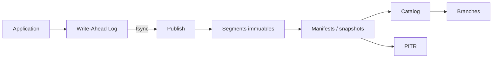

CasysDB est une **base de données graphe embarquée** écrite en Rust, conçue pour s'exécuter directement dans votre processus applicatif sans serveur séparé.

## Design Embedded

### Zéro serveur
- Pas de daemon à gérer
- S'exécute dans le même processus que votre application
- Démarrage en **millisecondes**
- Footprint mémoire minimal

### Architecture de fichiers
```
my_database/
├── manifests/          # Snapshots (MVCC versions)
├── segments/           # Data segments (immutable)
├── wal/               # Write-Ahead Log
└── catalog.json       # Metadata
```

Chaque base de données est un **répertoire autosuffisant** que vous pouvez copier, archiver ou versionner avec Git.



## Moteur Rust

### Performance native
- **Compilé en binaire natif** (pas de VM, pas de JIT)
- Zéro garbage collection
- Memory-safe grâce au borrow checker de Rust
- Concurrence sans data races

### Bindings FFI
- **Python** : via PyO3 (wheels natifs)
- **TypeScript/Node.js** : via napi-rs
- Interface C stable pour autres langages

## Modèle de données

### Graphe de propriétés
```
(Person {name: "Alice", age: 30})-[:KNOWS {since: 2020}]->(Person {name: "Bob"})
```

- **Nodes** (nœuds) : Entités avec labels et propriétés
- **Edges** (arêtes) : Relations typées et orientées avec propriétés
- **Properties** (propriétés) : Clés-valeurs (string, int, float, bool, null)

### Indexation
- **Label Index** : Scan rapide par label (`MATCH (p:Person)`)
- **Property Index** : *En développement*
- **Edge Index** : Adjacency lists (in/out) pour traversées O(1)

## ISO GQL

CasysDB implémente le standard **ISO GQL** (Graph Query Language) :

```gql
MATCH (p:Person)-[:KNOWS*1..3]->(friend:Person)
WHERE p.name = 'Alice' AND friend.age > 25
RETURN friend.name, friend.age
ORDER BY friend.age DESC
LIMIT 10
```

### Clauses supportées
- `MATCH` : Pattern matching
- `WHERE` : Filtres et prédicats
- `RETURN` : Projection de résultats
- `WITH` : Pipeline intermédiaire
- `CREATE` : Création de nodes/edges
- `SET` : Mise à jour de propriétés
- `DELETE` : Suppression
- `ORDER BY` / `LIMIT` : Tri et pagination
- `EXISTS` : Subqueries corrélées

### Fonctions
- `COUNT()`, `SUM()`, `AVG()`, `MIN()`, `MAX()`
- `ID()` : Identifiant interne du nœud
- Opérateurs arithmétiques : `+`, `-`, `*`, `/`
- Prédicats : `IS NULL`, `IS NOT NULL`

## Déploiement

### Scénarios d'usage

#### 1. Application locale
```python
from casys_db import Database

db = Database("./local.db")
```

#### 2. Application web (backend)
```python
# FastAPI / Flask
db = Database("/var/data/graphs/prod.db")
```

#### 3. ML/AI pipelines
```python
# Embeddings + Knowledge Graph
db = Database("./knowledge_base.db")
branch = db.create_branch("experiment-llama3")
```

#### 4. Edge computing
Déployez CasysDB directement sur des devices IoT, Raspberry Pi, ou edge servers sans infrastructure lourde.

## Comparaison

| Feature | CasysDB | Neo4j | SQLite | PostgreSQL |
|---------|---------|-------|--------|------------|
| **Embedded** | ✅ | ❌ (server) | ✅ | ❌ (server) |
| **Graph Queries** | ✅ ISO GQL | ✅ Cypher | ❌ | ⚠️ (via extension) |
| **MVCC** | ✅ | ✅ | ❌ | ✅ |
| **PITR** | ✅ | ❌ | ❌ | ❌ |
| **Zero Deps** | ✅ | ❌ (JVM) | ✅ | ❌ |
| **License** | MIT | GPL/Commercial | Public Domain | PostgreSQL |

## Prochaines étapes

- **Transactions MVCC** → `/core/transactions/`
- **Storage Layout** → `/core/storage/`
- **WAL** → `/core/wal/`
- **Segments immuables** → `/core/segments/`
- **Snapshots & Manifests** → `/core/snapshots/`
- **Concurrence SW‑MR** → `/core/concurrency/`
- **Commit Flow** → `/core/commit-flow/`
- **Catalog** → `/core/catalog/`
- **Branches & Time Travel** → `/core/branches/`
- **Installation** → `/getting-started/installation/`
