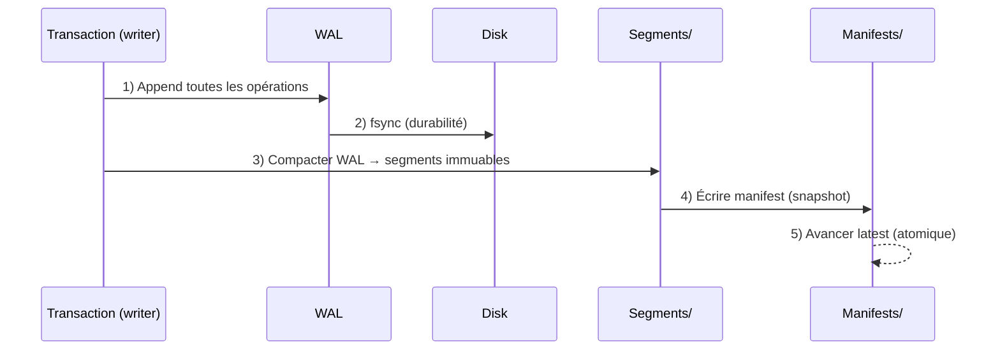

Le **commit** suit un chemin strict pour garantir la **durabilité** et la **cohérence**.

## Étapes

## Garanties
- **Atomicité**: latest n’avance qu’une fois le manifest écrit
- **Durabilité**: fsync avant publication
- **Lisibilité**: lecteurs lisent uniquement des snapshots publiés

## Défaillances et reprise
- Si crash avant `fsync`: la transaction est perdue (sécurité > commodité)
- Si crash après `fsync` mais avant publication: recovery lit WAL et ignore manifest absent
- Si manifest partiel: ignoré (validation JSON + atomie du pointeur)

## Liens
- [WAL →](/core/wal/)
- [Snapshots & Manifests →](/core/snapshots/)
- [Concurrence SW‑MR →](/core/concurrency/)
