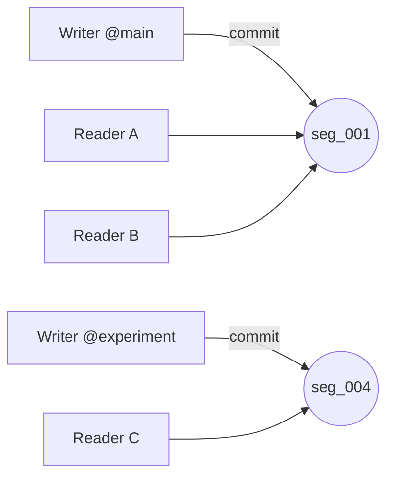

CasysDB applique un modèle **SW‑MR** (Single‑Writer, Multiple‑Readers) par **branche**.

## Règles
- **1 seul writer** par branche (verrou d’écriture par branche)
- **Lecteurs illimités**: lisent des **segments immuables**
- **Zéro blocage**: lecteurs et writer ne se bloquent pas

## Avantages
- **Prévisible**: pas de deadlocks
- **Performant**: writer séquentiel, lecteurs en parallèle
- **Sûr**: crash du writer ≠ corruption des segments existants

## Liens
- [Transactions MVCC →](/core/transactions/)
- [Commit Flow →](/core/commit-flow/)
