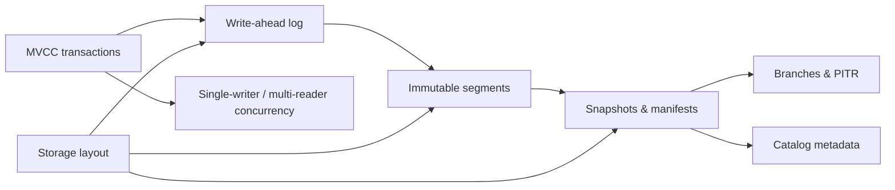

This section covers the internal mechanics of the CasysDB storage engine. It focuses on how data is persisted, versioned, and recovered; higher-level topics such as ISO GQL and the SDKs are documented in their dedicated sections.

## Concept map

## Recommended reading order

1. **Architecture** — overview of the embedded design and on-disk layout.
2. **Transactions** — MVCC model, snapshot isolation, and atomic commits.
3. **Write-ahead log** — durability guarantees and crash recovery.
4. **Segments** — immutable data files shared across branches.
5. **Snapshots & manifests** — publishing versions and enabling PITR.
6. **Branches & PITR** — Git-style branching for experiments and recovery.
7. **Concurrency model** — single-writer per branch, lock-free readers.
8. **Commit flow** — critical path taken during a successful commit.
9. **Catalog** — lightweight metadata index for branch heads.

## Out of scope

- **Graph Query Language (GQL)** — see the [GQL section](/docs/gql/basics/).
- **SDKs and ORM** — see the [Python SDK reference](/docs/sdk/python/basics/).
- **Operational guidance** — deployment, observability, and tooling are tracked separately as the project matures.
