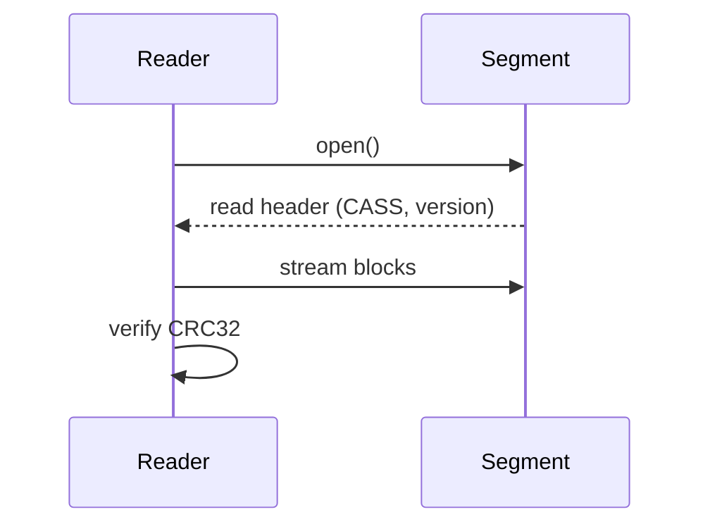

import Steps from '~/features/docs/Steps.astro';
import KVList from '~/features/docs/KVList.astro';

Les **segments** sont des fichiers immuables produits à partir du WAL. Ils sont référencés par les **manifests** et partagés entre branches.

## Format
- **En-tête**: magic `CASS`, version, tailles, **CRC32**
- **Blocs**: pages de données optimisées pour la lecture
- **Checksum**: validation de bout en bout

<KVList
  title="En-tête segment"
  items={[
    { key: 'Magic', value: 'CASS' },
    { key: 'Version', value: 'u16 (compatibilité lecture)' },
    { key: 'Header size', value: 'taille des méta-blocs' },
    { key: 'CRC32', value: 'checksum du payload' },
  ]}
/>

```text
segment_xxx.dat
┌──────────┬───────────┬─────────┬──────────────┐
│  CASS    │ version   │ header  │  payload...  │
└──────────┴───────────┴─────────┴──────────────┘
                        \__ CRC32 sur payload
```

## Lecture
:::tip[Validation CRC32]
La lecture vérifie systématiquement la **CRC32** du payload. En cas de corruption, le lecteur **rejette** le segment et remonte une erreur contrôlée.
:::

<Steps title="Chemin de lecture">
  <li class="step">Ouvrir le fichier segment (read-only)</li>
  <li class="step">Lire et vérifier l’en-tête (magic, version)</li>
  <li class="step">Streamer les blocs de données</li>
  <li class="step">Vérifier la CRC32 sur le payload</li>
</Steps>



## Propriétés
- **Immuable**: parfait pour le partage entre branches
- **Cache-friendly**: lecture séquentielle
- **Corruption détectée**: via CRC32

## Liens
- [Snapshots & Manifests →](/core/snapshots/)
- [Storage Layout →](/core/storage/)
