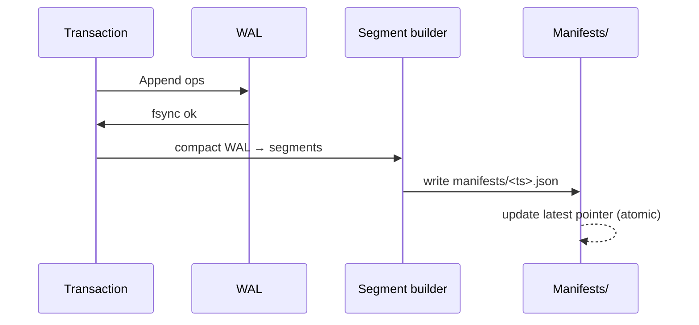

Chaque **commit** publie un **manifest** qui référence une liste de **segments** immuables. Les manifests forment une **chaîne** (parent → enfant), ce qui autorise le **Time Travel (PITR)** et les **branches**.

## Manifest
```json
{
  "version_ts": 1730899200,
  "branch": "main",
  "segments": ["seg_001", "seg_002"],
  "parent": "manifest_prev"
}
```

## Publication d’un snapshot


## Propriétés
- **Immuabilité**: lecture sûre, partage entre branches
- **Atomicité**: le pointeur `latest` n’avance que si tout a réussi
- **PITR**: remonter à un `version_ts` antérieur

## Liens
- [Branches →](/core/branches/)
- [Commit Flow →](/core/commit-flow/)
- [Storage Layout →](/core/storage/)
