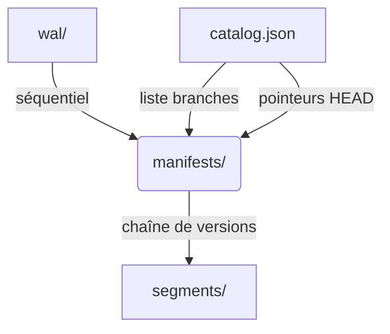

CasysDB stocke tout dans un dossier de base de données autosuffisant.

```
my_database/
├── manifests/          # Snapshots (chaîne immuable)
├── segments/           # Segments de données (immutables)
├── wal/                # Write-Ahead Log (append-only)
└── catalog.json        # Métadonnées (branches, pointeurs)
```

## Principes
- **Autosuffisant**: copier/déplacer/archiver le dossier suffit.
- **Append-only**: données écrites séquentiellement (WAL → segments immuables).
- **Snapshots**: chaque commit publie un manifest pointant vers un ensemble de segments.
- **Catalog**: index léger pour retrouver branches et dernières versions.

## Layout logique


## Bonnes pratiques
- Versionnez le dossier complet (ex: tar/zip) pour des backups fiables.
- Évitez d’éditer manuellement `catalog.json` et les manifests.
- Utilisez les API de branchement pour PITR plutôt que d’écraser des fichiers.

## Liens
- [WAL →](/core/wal/)
- [Segments →](/core/segments/)
- [Snapshots & Manifests →](/core/snapshots/)
- [Catalog →](/core/catalog/)
