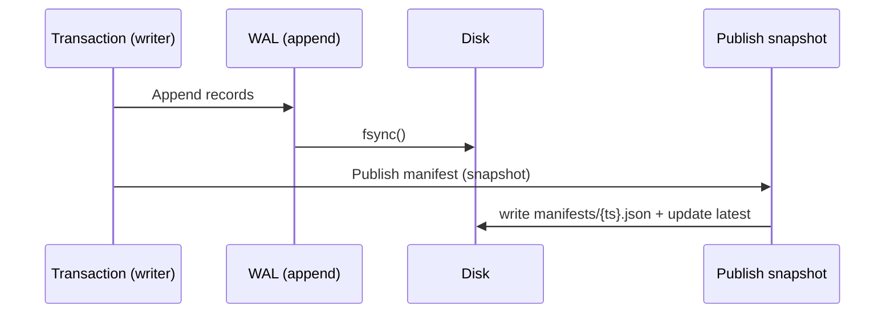

Le **WAL** enregistre séquentiellement toutes les écritures avant leur publication. Il garantit la **durabilité** (fsync) et sert de source pour produire des **segments immuables**.

## Propriétés
- **Append-only**: écritures séquentielles, rapides et sûres.
- **Rotation**: fichiers de taille bornée, rotation automatique.
- **Relecture**: reconstruction possible après crash.

## Cycle
:::warning[Durabilité]
Le **fsync** est requis avant la publication d’un snapshot. En cas de crash après fsync mais **avant** publication, la récupération rejouera le WAL et ignorera tout manifest manquant.
:::

## Éléments écrits
- Métadonnées de transaction (début/fin)
- Opérations de création/mise à jour/suppression
- Checksums pour validation

## Rotation
- Déclenchée par **taille** ou **temps**.
- Les fichiers fermés restent lisibles et intègres.

## Crash Safety
- Après crash, relecture séquentielle du WAL pour retrouver le dernier **snapshot publié**.
- Les enregistrements partiels en fin de fichier sont ignorés (checksum).

## Liens
- [Segments →](/core/segments/)
- [Commit Flow →](/core/commit-flow/)
