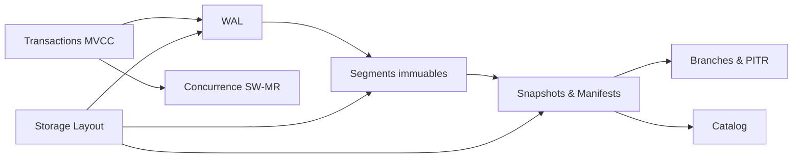

Cette section couvre les principes du moteur de base de CasysDB, **sans** entrer dans le langage GQL, l’ORM ou les SDK.

## Carte des concepts

## Lectures conseillées
- **1. Architecture** → vue globale des choix embedded et fichiers
- **2. Transactions MVCC** → isolation par snapshot
- **3. WAL** → durabilité par append + fsync
- **4. Segments** → immutables, CRC32, partage entre branches
- **5. Snapshots & Manifests** → publication atomique et time travel
- **6. Branches & PITR** → Git-like, expériences sans downtime
- **7. Concurrence SW‑MR** → 1 writer/branche, lecteurs illimités
- **8. Commit Flow** → chemin critique et garanties
- **9. Catalog** → index léger des HEADs

## Objectifs non traités ici
- Langage de requête **GQL** (pages dédiées)
- **ORM** (pattern d’accès applicatif)
- **SDK** Python/TypeScript (bindings)

Suivez l’ordre ci‑dessus pour comprendre le fonctionnement interne du moteur, puis consultez les sections GQL/SDK pour l’usage applicatif.
